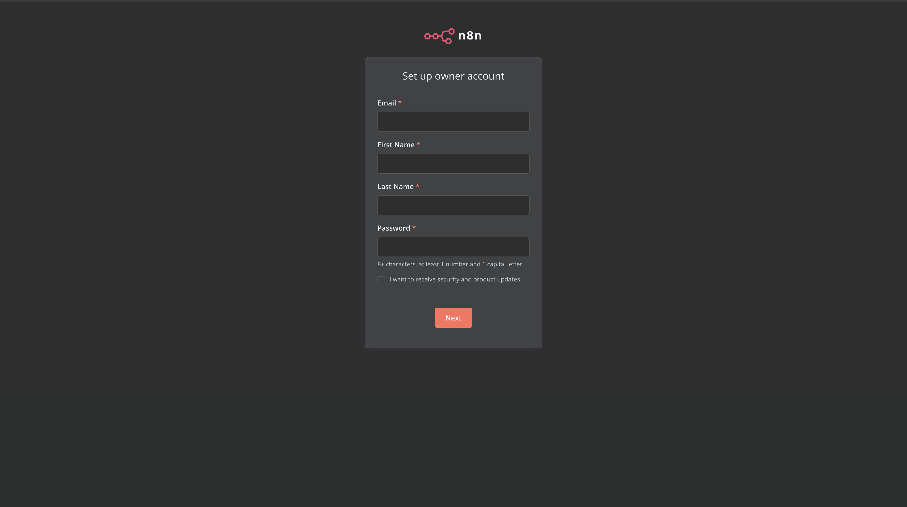
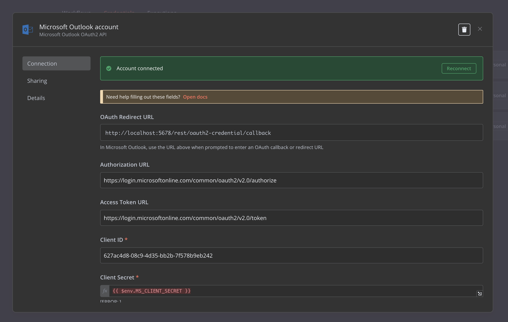
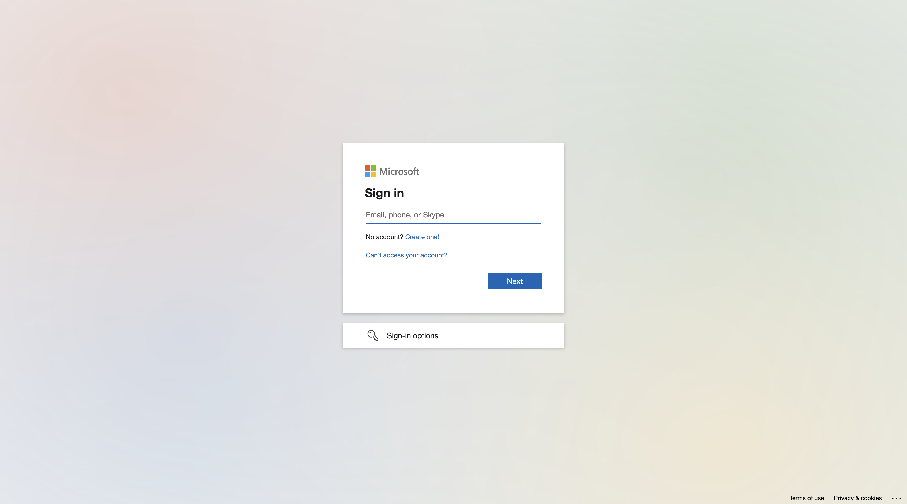

# Installation

### Pre-requisite
Git, Docker and Docker Compose is required for the Lumiq personal assistant to work.  
Install Docker Desktop from [here](https://www.docker.com/products/docker-desktop/) and start it.

### One Time Setup
```bash
git clone https://github.com/vishal-pandey/personal-assistant.git
cd personal-assistant

# Update the docker-compose file to populate the credentials
nano / vi docker-compose.yaml

# find the line
      - LLM_KEY=<your-chatgpt-token>

# update the variable with your chatgpt token

# find the line
      - MS_CLIENT_SECRET=<client-secret>
# update the variable with client secret email vishal.pandey@lumiq.ai for the client secret, will send it.

# Remove previous instance of application installed -- if any
docker compose down --remove-orphans

# Start the application and run in backgrond
docker compose up -d

```

**Wait for few minutes for the magic to work**

### Setup the n8n Instance
Visit http://localhost:5678 and create your account.  



After that  
Visit http://localhost:5678/home/credentials/jImBHIr3dzXoRQP8 and click on reconnect button



Login to your lumiq Microsoft  id and give permission.  



After that close the tab

Now Open  
http://localhost:8000  
To access the Lumiq Personal Assistant


